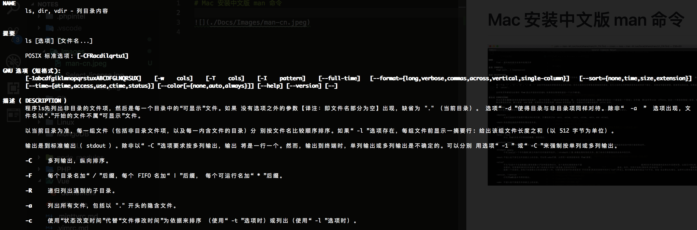

# Mac 安装中文版 man 帮助命令



## [linux 环境安装](https://github.com/man-pages-zh/manpages-zh/blob/master/README.md)

## macOS 环境安装

### 编译工具安装

因为需要编译安装，所以你电脑上需要有编译工具，运行下面两个命令安装

``` bash
$ brew install automake
$ brew install opencc
```

### 安装

``` bash
# 进入下载目录
$ cd ~/Downloads/
# 下载最新版本的源码包
$ wget https://github.com/man-pages-zh/manpages-zh/archive/v1.6.3.3.tar.gz
# 解压源码包(atool命令，推荐安装这个工具，统一所有压缩文档的命令）
$ atool -x v1.6.3.3.tar.gz
# 或者使用这个命令解压
$ tar zxvf v1.6.3.3.tar.gz
# 进入源码包文件夹
$ cd manpages-zh-1.6.3.3/
# 编译安装 1
$ autoreconf --install --force
# 编译安装 2
$ ./configure
# 编译安装 3
$ sudo make
# 编译安装 4
$ sudo make install
# 配置别名（如果是 zsh 对应处理即可）
$ echo "alias cman='man -M /usr/local/share/man/zh_CN'" >> ~/.bash_profile
# 使别名生效
$ source ~/.bash_profile
# 我们就安装上了中文版本的 man 工具了，但是运行命令会发现乱码。
cman ls
```

### 安装 groff 新版本解决中文乱码的问题

``` bash
# 进入下载目录
$ cd ~/Downloads/
# 下载1.22版本的源码包
$ wget http://git.savannah.gnu.org/cgit/groff.git/snapshot/groff-1.22.tar.gz
# 解压
$ atool -x groff-1.22.tar.gz
# 进入目录
$ cd groff-1.22
# 编译安装
$ ./configure
$ sudo make
$ sudo make install
# 打开配置文件
$ sudo vim /etc/man.conf
# 进入编辑器之后，在文件末尾添加
`NROFF preconv -e UTF8 | /usr/local/bin/nroff -Tutf8 -mandoc -c`
# 保存退出
# 运行命令，完美解决乱码问题
cman ls
```
