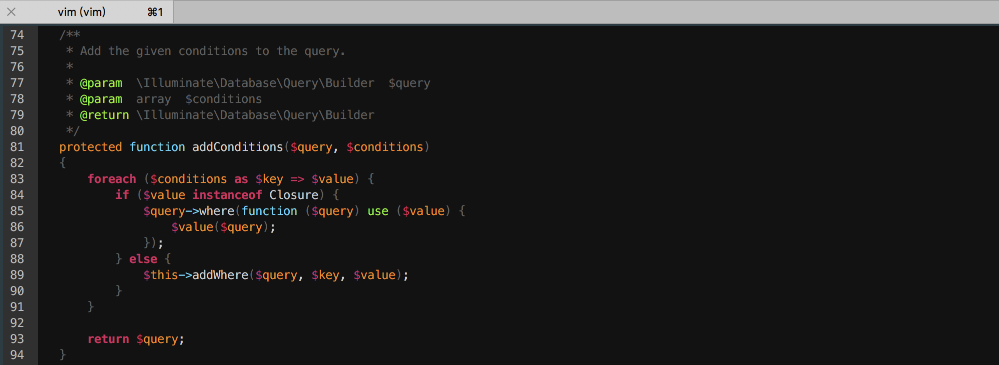

# 一份简单的没有插件的 vim 配置

## molokai 主题

如果习惯 molokai 主题，前往[https://github.com/tomasr/molokai](https://github.com/tomasr/molokai)



## .vimrc

``` bash
" leader
let mapleader = ','
let g:mapleader = ','

" syntax
syntax on

" history : how many lines of history VIM has to remember
set history=2000

" filetype
filetype on
" Enable filetype plugins
filetype plugin on
filetype indent on


" base
set nocompatible                " don't bother with vi compatibility
set autoread                    " reload files when changed on disk, i.e. via `git checkout`
set shortmess=atI

set magic                       " For regular expressions turn magic on
set title                       " change the terminal's title
set nobackup                    " do not keep a backup file

set novisualbell                " turn off visual bell
set noerrorbells                " don't beep
set visualbell t_vb=            " turn off error beep/flash
set t_vb=
set tm=500


" show location
set cursorcolumn
set cursorline


" movement
set scrolloff=7                 " keep 3 lines when scrolling


" show
set ruler                       " show the current row and column
set number                      " show line numbers
set nowrap
set showcmd                     " display incomplete commands
set showmode                    " display current modes
set showmatch                   " jump to matches when entering parentheses
set matchtime=2                 " tenths of a second to show the matching parenthesis


" search
set hlsearch                    " highlight searches
set incsearch                   " do incremental searching, search as you type
set ignorecase                  " ignore case when searching
set smartcase                   " no ignorecase if Uppercase char present


" tab
set expandtab                   " expand tabs to spaces
set smarttab
set shiftround

" indent
set autoindent smartindent shiftround
set shiftwidth=4
set tabstop=4
set softtabstop=4                " insert mode tab and backspace use 4 spaces

" NOT SUPPORT
" fold
set foldenable
set foldmethod=indent
set foldlevel=99
let g:FoldMethod = 0
map <leader>zz :call ToggleFold()<cr>
fun! ToggleFold()
    if g:FoldMethod == 0
        exe "normal! zM"
        let g:FoldMethod = 1
    else
        exe "normal! zR"
        let g:FoldMethod = 0
    endif
endfun

" encoding
set encoding=utf-8
set fileencodings=ucs-bom,utf-8,cp936,gb18030,big5,euc-jp,euc-kr,latin1
set termencoding=utf-8
set ffs=unix,dos,mac
set formatoptions+=m
set formatoptions+=B

" select & complete
set selection=inclusive
set selectmode=mouse,key

set completeopt=longest,menu
set wildmenu                           " show a navigable menu for tab completion"
set wildmode=longest,list,full
set wildignore=*.o,*~,*.pyc,*.class

" others
set backspace=indent,eol,start  " make that backspace key work the way it should
set whichwrap+=<,>,h,l

" if this not work ,make sure .viminfo is writable for you
if has("autocmd")
  au BufReadPost * if line("'\"") > 1 && line("'\"") <= line("$") | exe "normal! g'\"" | endif
endif

" NOT SUPPORT
" Enable basic mouse behavior such as resizing buffers.
" set mouse=a


" ============================ theme and status line ============================

" theme
set background=dark
colorscheme desert
" colorscheme molokai
" let g:molokai_original = 1
" let g:rehash256 = 1


" set mark column color
hi! link SignColumn   LineNr
hi! link ShowMarksHLl DiffAdd
hi! link ShowMarksHLu DiffChange

" status line
set statusline=%<%f\ %h%m%r%=%k[%{(&fenc==\"\")?&enc:&fenc}%{(&bomb?\",BOM\":\"\")}]\ %-14.(%l,%c%V%)\ %P
set laststatus=2   " Always show the status line - use 2 lines for the status bar


" ============================ specific file type ===========================

autocmd FileType python set tabstop=4 shiftwidth=4 expandtab ai
autocmd FileType ruby set tabstop=2 shiftwidth=2 softtabstop=2 expandtab ai
autocmd BufRead,BufNew *.md,*.mkd,*.markdown  set filetype=markdown.mkd

autocmd BufNewFile *.sh,*.py exec ":call AutoSetFileHead()"
function! AutoSetFileHead()
    " .sh
    if &filetype == 'sh'
        call setline(1, "\#!/bin/bash")
    endif

    " python
    if &filetype == 'python'
        call setline(1, "\#!/usr/bin/env python")
        call append(1, "\# encoding: utf-8")
    endif

    normal G
    normal o
    normal o
endfunc

autocmd FileType c,cpp,java,go,php,javascript,puppet,python,rust,twig,xml,yml,perl autocmd BufWritePre <buffer> :call <SID>StripTrailingWhitespaces()
fun! <SID>StripTrailingWhitespaces()
    let l = line(".")
    let c = col(".")
    %s/\s\+$//e
    call cursor(l, c)
endfun

" ============================ key map ============================

nnoremap k gk
nnoremap gk k
nnoremap j gj
nnoremap gj j

map <C-j> <C-W>j
map <C-k> <C-W>k
map <C-h> <C-W>h
map <C-l> <C-W>l

nnoremap <F2> :set nu! nu?<CR>
nnoremap <F3> :set list! list?<CR>
nnoremap <F4> :set wrap! wrap?<CR>
set pastetoggle=<F5>            "    when in insert mode, press <F5> to go to
                                "    paste mode, where you can paste mass data
                                "    that won't be autoindented
au InsertLeave * set nopaste
nnoremap <F6> :exec exists('syntax_on') ? 'syn off' : 'syn on'<CR>

" kj 替换 Esc
inoremap kj <Esc>

" Quickly close the current window
nnoremap <leader>q :q<CR>
" Quickly save the current file
nnoremap <leader>w :w<CR>

" select all
map <Leader>sa ggVG"

" remap U to <C-r> for easier redo
nnoremap U <C-r>

" Swap implementations of ` and ' jump to markers
" By default, ' jumps to the marked line, ` jumps to the marked line and
" column, so swap them
nnoremap ' `
nnoremap ` '

" switch # *
" nnoremap # *
" nnoremap * #

"Keep search pattern at the center of the screen."
nnoremap <silent> n nzz
nnoremap <silent> N Nzz
nnoremap <silent> * *zz
nnoremap <silent> # #zz
nnoremap <silent> g* g*zz

" remove highlight
noremap <silent><leader>/ :nohls<CR>

"Reselect visual block after indent/outdent.调整缩进后自动选中，方便再次操作
vnoremap < <gv
vnoremap > >gv

" y$ -> Y Make Y behave like other capitals
map Y y$

"Map ; to : and save a million keystrokes
" ex mode commands made easy 用于快速进入命令行
nnoremap ; :

" Shift+H goto head of the line, Shift+L goto end of the line
nnoremap H ^
nnoremap L $

" save
cmap w!! w !sudo tee >/dev/null %

" command mode, ctrl-a to head， ctrl-e to tail
cnoremap <C-j> <t_kd>
cnoremap <C-k> <t_ku>
cnoremap <C-a> <Home>
cnoremap <C-e> <End>
```

## 原配置地址

* [https://github.com/wklken/vim-for-server](https://github.com/wklken/vim-for-server)
